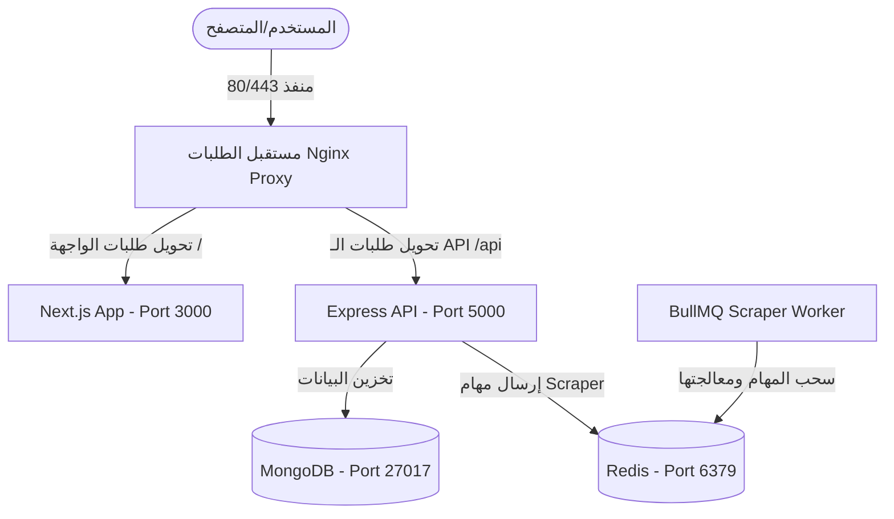
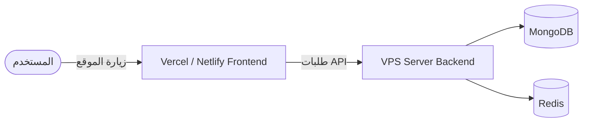

# دليل تشغيل وتثبيت منصة Studivo (Deployment Guide)

مرحباً بك في دليل التثبيت الشامل لمنصة **Studivo** (لوحة التحكم للطلاب والمستشارين). هذا الدليل يشرح بالتفصيل بنية المشروع (Architecture)، وكيفية تثبيته وتشغيله على أي خادم VPS جديد، سواء قمت بتثبيت الواجهة الخلفية والواجهة الأمامية معاً على نفس السيرفر، أو فصلهما على سيرفرين مختلفين.

---

## 🏗️ البنية العامة للمشروع (Architecture Overview)

يتكون المشروع من ثلاثة أجزاء رئيسية:
1. **واجهة المستخدم (studivo-ui)**: مبنية باستخدام Next.js (تشتغل بشكل افتراضي على منفذ `3000`).
2. **الخادم الخلفي (studivo-server)**: مبني باستخدام Node.js/Express (يشتغل بشكل افتراضي على منفذ `5000`).
3. **قاعدة البيانات والذاكرة المؤقتة**:
   - **MongoDB** (المنفذ `27017`): لتخزين المستخدمين، العروض، الطلبات، والرسائل.
   - **Redis** (المنفذ `6379`): لإدارة صف الطوابير (BullMQ) الخاص بـ Scraper والعمليات المؤقتة.

### مخطط الاتصال والربط:



---

## 🛠️ المتطلبات الأساسية للسيرفر (Prerequisites)
- خادم يعمل بنظام **Ubuntu 22.04 LTS** أو أحدث.
- مواصفات الخادم: يُفضل ألا تقل الذاكرة العشوائية (RAM) عن **1 جيجابايت** (مع تفعيل الـ Swap File كما هو موضح بالأسفل لتفادي توقف السيرفر بسبب امتلاء الذاكرة OOM).

---

## 📋 الخيار الأول: تثبيت المشروع كاملاً على خادم VPS واحد (الخيار الأسهل والأوفر)

في هذا السيناريو، نقوم برفع الواجهة الخلفية والأمامية وقاعدة البيانات والـ Redis على نفس السيرفر باستخدام خادم **Nginx** لتوجيه المرور و **PM2** لإبقاء التطبيقات قيد التشغيل.

### الخطوة 1: تهيئة البيئة وتثبيت الحزم الأساسية
يمكنك استخدام السكربت الجاهز الذي قمنا بحفظه لك في المجلد `vps-setup/deploy.sh`:
```bash
# 1. الدخول إلى مجلد المشروع المرفوع
cd /var/www/studivo/vps-setup

# 2. إعطاء صلاحية التنفيذ للسكربت
chmod +x deploy.sh

# 3. تشغيل السكربت كمسؤول (Root) لتثبيت Node.js, MongoDB, Redis, Nginx, PM2 تلقائياً
sudo ./deploy.sh
```

> [!NOTE]
> يقوم السكربت بتهيئة **2GB Swap Memory** تلقائياً وهو أمر بالغ الأهمية إذا كان السيرفر بحجم 1GB RAM لضمان عدم توقف السيرفر أثناء بناء المشروع (npm run build).

### الخطوة 2: استرجاع قاعدة البيانات (Restore MongoDB)
لقد قمنا بحفظ نسخة احتياطية من قاعدة البيانات الحالية داخل مجلد `db_backup`. لاسترجاعها في السيرفر الجديد:
```bash
# تشغيل أمر استرجاع قاعدة البيانات
mongorestore --db studivo /var/www/studivo/db_backup/studivo/
```

### الخطوة 3: إعداد ملفات البيئة للـ Backend
1. اذهب إلى مجلد السيرفر: `cd /var/www/studivo/studivo-server`
2. أنشئ ملف `.env` وقم بتعبئته بالقيم الحقيقية استناداً إلى الملف المرفق `.env.example`:
```env
PORT=5000
NODE_ENV=production
CLIENT_URL=https://yourdomain.com  # رابط الدومين الخاص بك
MONGODB_URI=mongodb://localhost:27017/studivo
REDIS_URL=redis://localhost:6379
JWT_SECRET=your_jwt_secret_key
JWT_REFRESH_SECRET=your_jwt_refresh_key
GEMINI_API_KEY=your_gemini_key
```

### الخطوة 4: إعداد ملفات البيئة للـ Frontend (Next.js)
1. اذهب إلى مجلد الواجهة: `cd /var/www/studivo/studivo-ui`
2. أنشئ ملف `.env.production` وضع فيه عنوان الـ API:
```env
NEXT_PUBLIC_API_URL=https://yourdomain.com/api
```

### الخطوة 5: تشغيل المشروع باستخدام PM2
1. انتقل للمجلد الرئيسي: `cd /var/www/studivo`
2. قم بتثبيت حزم الـ `node_modules` وبناء المشروع:
```bash
# تثبيت حزم خادم خلفية المشروع
cd studivo-server && npm install --production && cd ..

# تثبيت حزم واجهة المستخدم وعمل بناء لها
cd studivo-ui && npm install && npm run build && cd ..
```
3. تشغيل جميع الخدمات (API, UI, Scraper Worker) بضغطة واحدة باستخدام ملف التهيئة المرفق:
```bash
pm2 start ecosystem.config.js
pm2 save
pm2 startup
```

### الخطوة 6: إعداد Nginx وشهادة الأمان SSL (Certbot)
1. انسخ ملف إعدادات Nginx المرفق إلى خادم Nginx الفعلي:
```bash
sudo cp /var/www/studivo/nginx/studivo.prod.conf /etc/nginx/sites-available/studivo
sudo ln -sf /etc/nginx/sites-available/studivo /etc/nginx/sites-enabled/
sudo rm -f /etc/nginx/sites-enabled/default
```
2. قم بتثبيت شهادة SSL مجانية من Let's Encrypt:
```bash
sudo apt install -y certbot python3-certbot-nginx
sudo certbot --nginx -d yourdomain.com -d www.yourdomain.com
```
3. أعد تشغيل Nginx:
```bash
sudo systemctl reload nginx
```

---

## 🌐 الخيار الثاني: فصل الواجهة الأمامية (Frontend) عن الخلفية (Backend)

إذا كنت ترغب في توفير موارد السيرفر، أو رفع الـ Frontend على منصة مجانية/سحابية مثل **Vercel** أو **Netlify**، وتشغيل الـ Backend فقط على سيرفر VPS.



### 1. إعداد الواجهة الخلفية (Backend VPS)
على خادم الـ VPS، ستقوم بتثبيت الـ Backend فقط مع قاعدة البيانات والـ Redis.

1. **الملف `.env` للـ Backend**:
   - يجب إعداد الـ `CLIENT_URL` لكي يشير إلى رابط الـ Frontend المرفوع على Vercel أو المنصة الأخرى للسماح بنظام CORS:
     ```env
     CLIENT_URL=https://studivo-frontend.vercel.app
     ```
2. **Nginx للـ Backend**:
   - ستقوم فقط بتوجيه المنفذ `5000` (الخاص بالـ API) مباشرة تحت الدومين الفرعي (مثلاً `api.yourdomain.com`).
   - ملف الإعدادات للـ Nginx سيكون بسيطاً جداً:
     ```nginx
     server {
         server_name api.yourdomain.com;
         location / {
             proxy_pass http://localhost:5000;
             proxy_http_version 1.1;
             proxy_set_header Upgrade $http_upgrade;
             proxy_set_header Connection 'upgrade';
             proxy_set_header Host $host;
             proxy_cache_bypass $http_upgrade;
         }
     }
     ```
3. **التشغيل**:
   - ستقوم فقط بتشغيل الـ `studivo-api` والـ `studivo-worker` باستخدام PM2:
     ```bash
     pm2 start ecosystem.config.js --only "studivo-api,studivo-worker"
     ```

### 2. إعداد الواجهة الأمامية (Frontend on Vercel/Netlify)
1. قم برفع مجلد `studivo-ui` فقط إلى مستودع GitHub منفصل أو اربطه مباشرة بـ Vercel.
2. في إعدادات البيئة (Environment Variables) على Vercel، أضف المتغير التالي:
   - **Key**: `NEXT_PUBLIC_API_URL`
   - **Value**: `https://api.yourdomain.com` (رابط الـ API الخاص بـ VPS السيرفر الخلفي).
3. ستقوم المنصة ببناء وتشغيل الموقع بشكل تلقائي ومجاني دون استهلاك أي معالج أو ذاكرة من خادم الـ VPS الخاص بك.

---

## 📝 شرح متغيرات البيئة الهامة (Environment Variables)

### الواجهة الخلفية (Backend)
- `MONGODB_URI`: رابط الاتصال بقاعدة البيانات. (إذا كانت محلية: `mongodb://localhost:27017/studivo`).
- `REDIS_URL`: رابط الاتصال بـ Redis لإدارة طوابير المهام. (محلية: `redis://localhost:6379`).
- `JWT_SECRET` / `JWT_REFRESH_SECRET`: مفاتيح تشفير عشوائية لتأمين تسجيل دخول المستخدمين.
- `GEMINI_API_KEY`: مفتاح API الخاص بـ Google Gemini لمعالجة طلبات الذكاء الاصطناعي.
- `CLOUDINARY_CLOUD_NAME` / `API_KEY` / `API_SECRET`: لتخزين ورفع صور العروض والطلبات سحابياً.

### الواجهة الأمامية (Frontend)
- `NEXT_PUBLIC_API_URL`: الرابط الذي تستخدمه الواجهة لإرسال الطلبات إلى السيرفر الخلفي. يجب أن ينتهي بـ `/api`.

---

## 📊 أوامر إدارة ومراقبة التشغيل اليومية (Useful Commands)

```bash
# لعرض حالة جميع العمليات
pm2 status

# لمشاهدة سجلات الأخطاء والتشغيل مباشرة (Logs)
pm2 logs

# لمراقبة استهلاك المعالج والذاكرة بشكل رسومي في الـ Terminal
pm2 monit

# لإعادة تشغيل السيرفر بالكامل
pm2 restart all
```
