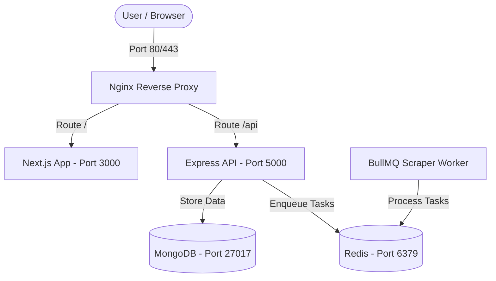
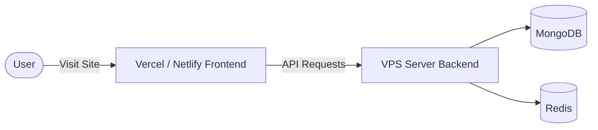

# Studivo Platform Deployment & Installation Guide

Welcome to the comprehensive deployment guide for the **Studivo** platform (a dashboard control panel for students and advisors). This guide details the project's architecture and explains how to install and run it on any new VPS server, whether you deploy the frontend and backend together on a single server, or split them across different servers.

---

## 🏗️ Architecture Overview

The project is composed of three main parts:
1. **Frontend (studivo-ui)**: A Next.js application running by default on port `3000`.
2. **Backend API (studivo-server)**: A Node.js/Express API running by default on port `5000`.
3. **Database & Cache**:
   - **MongoDB** (Port `27017`): Stores users, offers, requests, and messages.
   - **Redis** (Port `6379`): Manages the BullMQ scraper queues and active server cache.

### Connection & Proxy Flow:



---

## 🛠️ Prerequisites
- A server running **Ubuntu 22.04 LTS** or newer.
- Minimum Specs: **1GB RAM** (activating 2GB Swap Space is highly recommended, as outlined below, to prevent out-of-memory errors during build stages).

---

## 📋 Option 1: Single VPS Server Deployment (Monolithic Setup)

In this scenario, you deploy the Frontend, Backend, Database, and Redis on the same VPS. Nginx acts as a reverse proxy, and PM2 manages the Node.js processes.

### Step 1: Environment Initialization & Setup
You can use the helper script saved under the `vps-setup/` folder:
```bash
# 1. Navigate to the setup folder
cd /var/www/studivo/vps-setup

# 2. Make the script executable
chmod +x deploy.sh

# 3. Run the deployment script as root to automatically install Node.js, MongoDB, Redis, Nginx, and PM2
sudo ./deploy.sh
```

> [!NOTE]
> The setup script configures a **2GB Swap file** automatically. This is essential for a 1GB VPS to avoid OOM crashes when running `npm run build` in Next.js.

### Step 2: Restore MongoDB Database
A backup of the database is saved under the `db_backup/` directory. To restore it on the new server:
```bash
# Restore MongoDB from the backup dump
mongorestore --db studivo /var/www/studivo/db_backup/studivo/
```

### Step 3: Configure Backend Environment Variables
1. Navigate to the backend directory: `cd /var/www/studivo/studivo-server`
2. Create a `.env` file and populate it with real values based on `.env.example`:
```env
PORT=5000
NODE_ENV=production
CLIENT_URL=https://yourdomain.com  # Your website's frontend domain URL
MONGODB_URI=mongodb://localhost:27017/studivo
REDIS_URL=redis://localhost:6379
JWT_SECRET=your_jwt_secret_key
JWT_REFRESH_SECRET=your_jwt_refresh_key
GEMINI_API_KEY=your_gemini_key
```

### Step 4: Configure Frontend Environment Variables
1. Navigate to the frontend directory: `cd /var/www/studivo/studivo-ui`
2. Create a `.env.production` file pointing to the backend API endpoint:
```env
NEXT_PUBLIC_API_URL=https://yourdomain.com/api
```

### Step 5: Build & Run with PM2
1. Go back to the root directory: `cd /var/www/studivo`
2. Install dependencies and build the projects:
```bash
# Install backend dependencies
cd studivo-server && npm install --production && cd ..

# Install frontend dependencies and build production assets
cd studivo-ui && npm install && npm run build && cd ..
```
3. Start all services (API, UI, and Scraper Worker) simultaneously using PM2:
```bash
pm2 start ecosystem.config.js
pm2 save
pm2 startup
```

### Step 6: Configure Nginx & SSL Certificate (Certbot)
1. Copy the production Nginx config to the sites-available directory:
```bash
sudo cp /var/www/studivo/nginx/studivo.prod.conf /etc/nginx/sites-available/studivo
sudo ln -sf /etc/nginx/sites-available/studivo /etc/nginx/sites-enabled/
sudo rm -f /etc/nginx/sites-enabled/default
```
2. Install Let's Encrypt Certbot and generate an SSL Certificate:
```bash
sudo apt install -y certbot python3-certbot-nginx
sudo certbot --nginx -d yourdomain.com -d www.yourdomain.com
```
3. Restart Nginx to apply changes:
```bash
sudo systemctl reload nginx
```

---

## 🌐 Option 2: Split Server Deployment (Frontend and Backend Separated)

If you want to optimize server resources, you can host the Frontend on a serverless/static platform like **Vercel** or **Netlify** (usually free), and host only the Backend API, Database, and Redis on a VPS server.



### 1. Configure the Backend (VPS API Server)
On your VPS, you only need to run the API, database, and Redis.

1. **Backend `.env` file configuration**:
   - Make sure `CLIENT_URL` points to your Vercel/Netlify frontend domain to bypass CORS restrictions:
     ```env
     CLIENT_URL=https://studivo-frontend.vercel.app
     ```
2. **Nginx for Backend API**:
   - Set up Nginx to proxy port `5000` (the API server) on a subdomain (e.g. `api.yourdomain.com`).
   - Here is a simple Nginx virtual host configuration:
     ```nginx
     server {
         server_name api.yourdomain.com;
         location / {
             proxy_pass http://localhost:5000;
             proxy_http_version 1.1;
             proxy_set_header Upgrade $http_upgrade;
             proxy_set_header Connection 'upgrade';
             proxy_set_header Host $host;
             proxy_cache_bypass $http_upgrade;
         }
     }
     ```
3. **Running the API**:
   - Start only `studivo-api` and `studivo-worker` on PM2:
     ```bash
     pm2 start ecosystem.config.js --only "studivo-api,studivo-worker"
     ```

### 2. Configure the Frontend (Vercel/Netlify Static Hosting)
1. Push only the `studivo-ui` directory to a clean GitHub repository and link it to Vercel/Netlify.
2. In the hosting provider's dashboard, configure the following environment variable:
   - **Key**: `NEXT_PUBLIC_API_URL`
   - **Value**: `https://api.yourdomain.com` (Your backend VPS server subdomain URL).
3. The platform will build and deploy Next.js automatically, completely freeing up RAM and CPU on your VPS.

---

## 📝 Environment Variables Reference

### Backend Variables (`studivo-server`)
- `MONGODB_URI`: MongoDB connection string. (Local: `mongodb://localhost:27017/studivo`).
- `REDIS_URL`: Redis connection URL. (Local: `redis://localhost:6379`).
- `JWT_SECRET` / `JWT_REFRESH_SECRET`: Random hash keys used for token-based user authentication.
- `GEMINI_API_KEY`: API key from Google AI Studio used to run Gemini models.
- `CLOUDINARY_CLOUD_NAME` / `API_KEY` / `API_SECRET`: Cloudinary API configurations used for cloud image uploads.

### Frontend Variables (`studivo-ui`)
- `NEXT_PUBLIC_API_URL`: The URL where the Next.js client directs API requests. Needs to end in `/api`.

---

## 📊 Useful Operations & Monitoring Commands

Use these commands on your VPS server to manage the processes:

```bash
# Check the status of active PM2 processes
pm2 status

# Monitor live server logs
pm2 logs

# Display CPU and Memory utilization in terminal
pm2 monit

# Restart all running backend applications
pm2 restart all
```
